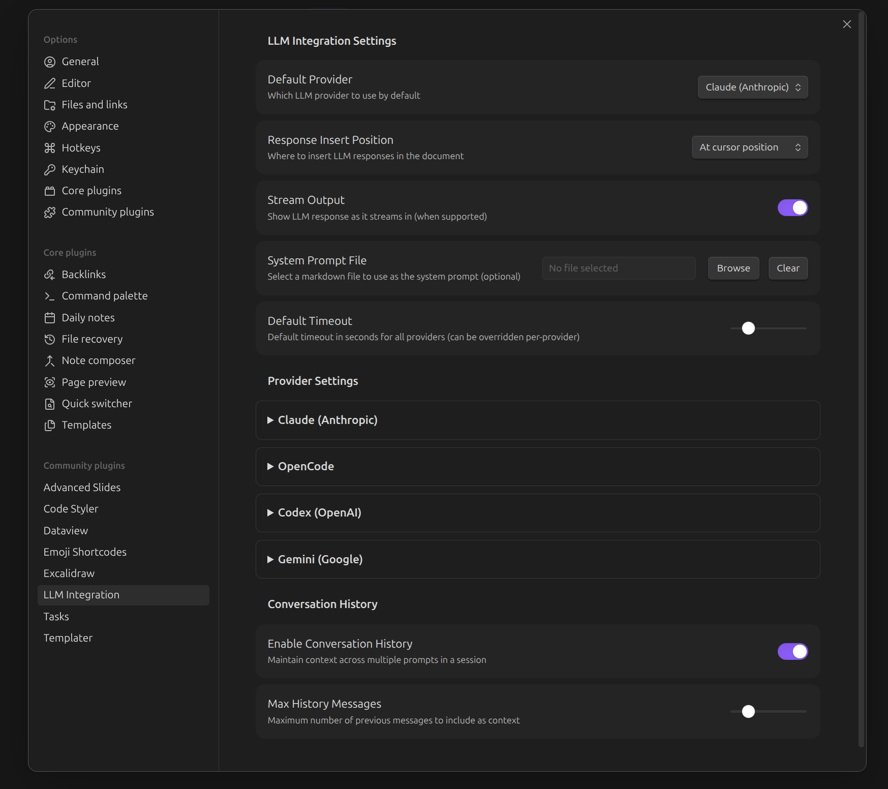

# Obsidian LLM Plugin

An Obsidian plugin that integrates with LLM CLI tools (Claude, Codex, OpenCode, Gemini) to provide AI-powered assistance directly within your vault.

## Features

- **Chat Panel** - Sidebar panel for conversations with LLMs (like an embedded terminal)
- **Multiple Providers** - Support for Claude, Codex, OpenCode, and Gemini CLI tools
- **Open Files Context** - Optionally include content from open notes as context
- **System Prompt from File** - Use a markdown file in your vault as the system prompt
- **Progress Indicators** - See what the LLM is doing (reading files, searching, etc.)
- **Markdown Rendering** - LLM responses rendered with full Obsidian markdown support, including internal links
- **Interactive Elements** - Checkboxes and buttons in responses are interactive; the LLM is notified when you interact with them
- **Create Notes from Responses** - Save LLM responses as new notes in your vault
- **Quick Prompts** - Commands for summarizing, explaining, and improving selected text
- **Session Continuation** - Follow-up messages use session resumption for faster responses
- **ACP Mode** - Optional persistent connection mode for faster multi-turn conversations

## Requirements

At least one LLM CLI tool must be installed and accessible in your PATH:

- [Claude CLI](https://github.com/anthropics/claude-cli) - `claude`
- [Codex CLI](https://github.com/openai/codex) - `codex`
- [OpenCode](https://github.com/opencode-ai/opencode) - `opencode`
- [Gemini CLI](https://github.com/google/gemini-cli) - `gemini`

## Installation

### Using BRAT (Recommended)

[BRAT](https://github.com/TfTHacker/obsidian42-brat) (Beta Reviewers Auto-update Tool) is the easiest way to install and keep the plugin updated:

1. Install the BRAT plugin from Obsidian's Community Plugins
2. Open BRAT settings and click "Add Beta Plugin"
3. Enter: `hardbyte/obsidian-llm-plugin`
4. Enable the plugin in Community Plugins settings

BRAT will automatically check for updates and notify you when new versions are available.

### Manual Installation

1. Download the latest release from the [releases page](https://github.com/hardbyte/obsidian-llm-plugin/releases)
2. Extract `main.js`, `manifest.json`, and `styles.css` to your vault's `.obsidian/plugins/obsidian-llm/` directory
3. Enable the plugin in Obsidian's Community Plugins settings

### Build from Source

```bash
git clone https://github.com/hardbyte/obsidian-llm-plugin.git
cd obsidian-llm-plugin
npm install
npm run build
```

Copy `main.js`, `manifest.json`, and `styles.css` to your vault's `.obsidian/plugins/obsidian-llm/` folder.

## Usage

### Chat Panel

1. Click the message icon in the ribbon or use the command "LLM: Open Chat"
2. The chat panel opens in the right sidebar
3. Type your message and press Enter to send (Shift+Enter for newlines)
4. Toggle "Include open files" to provide context from your workspace

**Message Actions:**
- Hover over any assistant message to reveal action buttons
- **Copy** - Copy the response to clipboard
- **Create Note** - Save the response as a new note in your vault

### Quick Commands

- **LLM: Quick Prompt** - Open a prompt dialog
- **LLM: Send Selection to LLM** - Send selected text to the LLM
- **LLM: Summarize Selection** - Summarize selected text
- **LLM: Explain Selection** - Get an explanation of selected text
- **LLM: Improve Writing** - Improve selected text
- **LLM: Generate from Current Note Context** - Generate based on current note

### Settings



- **Default Provider** - Choose which LLM to use by default
- **System Prompt File** - Select a markdown file to use as the system prompt
- **Default Timeout** - Set timeout for LLM requests (can be overridden per-provider)
- **Include Open Files** - Control whether open file content is sent as context
- **Conversation History** - Configure how many messages to include as context

## Configuration

### Provider Settings

Each provider can be configured with:
- Enable/disable
- Model selection (dropdown with common models, or enter custom model ID)
- Custom command (if CLI is named differently)
- Timeout override
- **ACP Mode** (experimental) - Use Agent Client Protocol for persistent connections
- **Thinking Mode** (ACP only) - Control extended thinking level (none/low/medium/high)

When ACP mode is enabled, the available models list is populated dynamically from the connected agent.

### System Prompt

Create a markdown file in your vault (e.g., `System Prompt.md`) with your preferred system prompt, then select it in settings. The content will be prepended to all LLM requests.

## Development

```bash
# Install dependencies
npm install

# Build for development (with watch)
npm run dev

# Build for production
npm run build
```

### Manual Testing in Obsidian

1. Create a test vault or use an existing one
2. Create a symbolic link from the build output to your vault's plugins folder:
   ```bash
   ln -s /path/to/obsidian-llm /path/to/vault/.obsidian/plugins/obsidian-llm
   ```
3. Run `npm run dev` to watch for changes
4. In Obsidian, enable the plugin and use Cmd/Ctrl+R to reload after changes
5. Open the Developer Console (Cmd/Ctrl+Shift+I) to see logs and errors

### E2E Testing

The plugin uses [wdio-obsidian-service](https://github.com/jesse-r-s-hines/wdio-obsidian-service) for end-to-end testing against a real Obsidian instance.

```bash
# Run E2E tests (builds first, then launches Obsidian)
npm run test:e2e

# Run E2E tests only (assumes already built)
npm run wdio
```

The test suite:
- Verifies plugin loads correctly
- Tests chat panel UI elements
- Tests user interaction (typing, sending messages)
- Tests settings navigation
- Tests context toggle functionality

Tests run automatically on GitHub Actions for pushes and pull requests.

## Architecture Notes

### Session Continuation

The plugin captures session IDs from CLI tools and uses them for subsequent requests within the same conversation:
- **Claude**: `--resume <session_id>`
- **OpenCode**: `--session <session_id>`
- **Gemini**: `--resume <session_id>`
- **Codex**: `--resume <session_id>`

This improves response times for follow-up messages. Clearing the conversation resets the session.

### ACP Mode (Agent Client Protocol)

ACP is a standardized protocol (like LSP but for AI agents) that provides:
- **Persistent connections** - No startup overhead per request
- **Streaming responses** - Real-time updates via JSON-RPC
- **Dynamic model discovery** - Available models fetched from the agent
- **Extended thinking** - Support for thinking mode levels

All four providers support ACP mode:
- **Claude** - via `@anthropic-ai/claude-code-acp` adapter
- **OpenCode** - native `opencode acp` server
- **Gemini** - via `gemini --experimental-acp` flag
- **Codex** - via `@zed-industries/codex-acp` adapter

Enable ACP in provider settings. The first message establishes a connection; subsequent messages reuse it for faster responses.

See also: [obsidian-agent-client](https://github.com/RAIT-09/obsidian-agent-client) for an alternative ACP-based approach

## License

MIT

## Credits

Built with [Obsidian Plugin API](https://docs.obsidian.md/Plugins/Getting+started/Build+a+plugin).
